# Microsoft Teams | DM API

### Introduction

In this article, we will work on an integration for Microsoft Teams and the Voiceflow Dialog Manager API.

A good starting point is to look at our documentation to understand the basics and get a better idea on what we are good to build here.

[Hello, Flow!](https://developer.voiceflow.com/docs)

### What you will need?

- Voiceflow account
- Chat project ready to be tested
- Teams account
- A computer with Node installed to test our integration locally

### 1) Setting up the application and creating a bot in Teams

The first this you will have to do is to add the Developer Portal app to your Teams

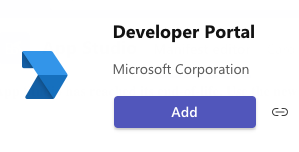

After the install you will find the app on the left sidebar

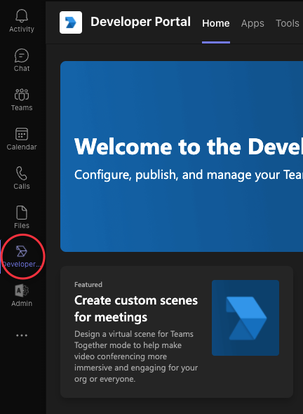

Go to the **Apps** tab and click on **+ New app**

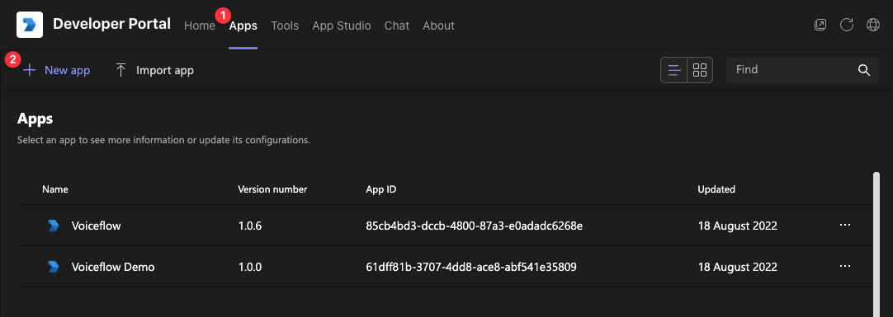

The next steps are pretty straight forward as you just need to fill the required fields.

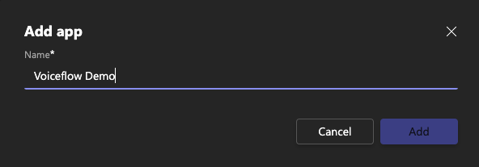

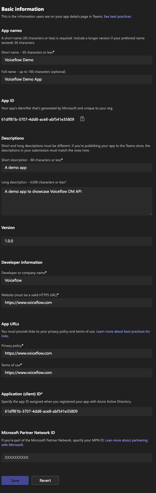

Click Save to create the app.


Now, create a Bot for your app.

Form the Tool tab, click on **+ New Bot**

We want to create a new Bot so click on the **Create a new bot** link

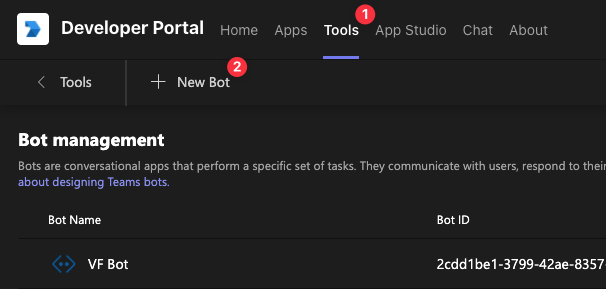

And give it a **name** before clicking on **Add**

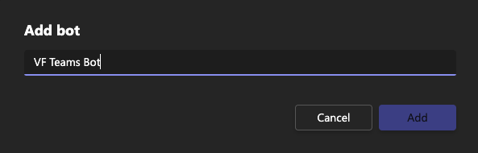

Keep that page **open** as we will need it later to fill the **Bot endpoint** address and generate a **client secret**

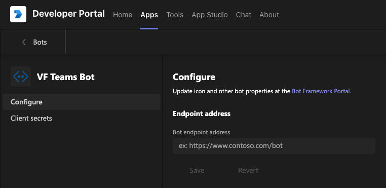

### 2) Setting up the code

<aside>
💡 For the following step, we are assuming that your dev environment is already setup

</aside>

In a directory, clone the following Git repository and install the dependencies

[https://github.com/voiceflow-gallagan/api-integration-msteams.git](https://github.com/voiceflow-gallagan/api-integration-msteams.git)

```bash
git clone https://github.com/voiceflow-gallagan/api-integration-msteams.git
cd api-integration-msteams && npm i
```

open the **.env.template** file in the editor of your choice

```bash
MicrosoftAppId='<your bot id>'
MicrosoftAppPassword='<your bot secret>'
VOICEFLOW_VERSION='development'
VOICEFLOW_API_KEY='<Voiceflow Chat project API>'
VOICEFLOW_RUNTIME_ENDPOINT='https://general-runtime.voiceflow.com'
TUNNEL_SUBDOMAIN='voiceflow-teams'
PORT=3978
```

Update the **TUNNEL_SUBDOMAIN** with the subdomain of your choice. Try to use something “unique” as we will use it to generate a tunnel so you will be able to test your Bot in Teams.

For the **VOICEFLOW_API_KEY**, simply copy/paste it form your Voiceflow’s project.

- open your Chat project in Voiceflow
- click on the Integrations button in the sidebar (shortcut: 4)
- copy your Dialog API key
- paste it in the **.env.template** file

    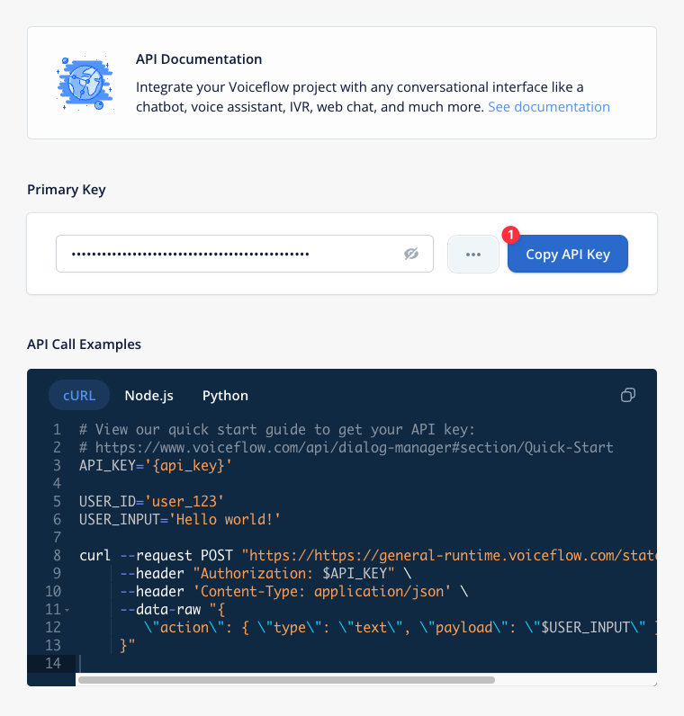


If you want to, you can also change the port you want to use. Here we will keep **3978**

Now, we will need to grab the **MicrosoftAppId** et **MicrosoftAppPassword** from the **Developer app** on **Teams**.

But first, let’s finish to setup our Bot, in the Endpoint address field, type the following URL

```bash
https://<your subdomain>.loca.lt/api/messages
```

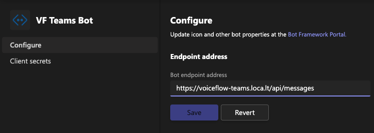

Click on **Save**

To generate the **MicrosoftAppPassword**, click on Client secrets on the left

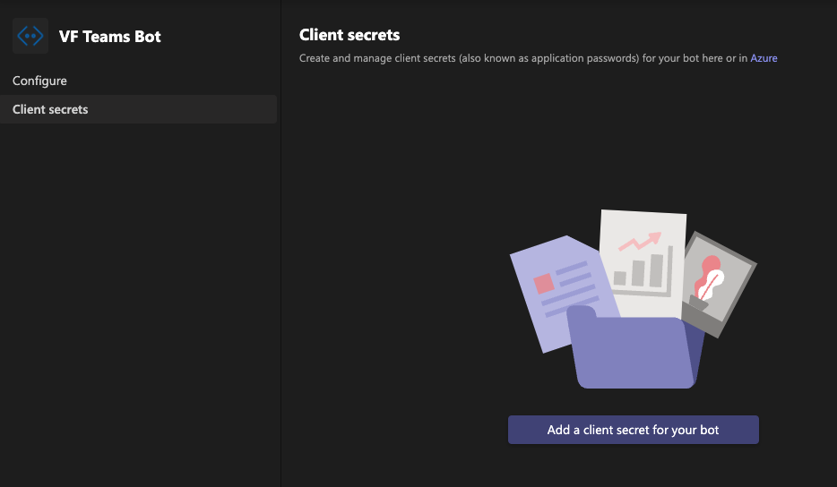

Then click on **Add a client secret for your bot**

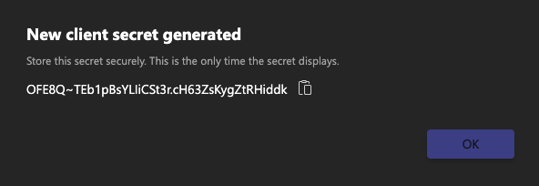

Copy the generated secret and paste it in your .env.template for the **MicrosoftAppPassword** value.

For the **MicrosoftAppId**, go back to the previous screen

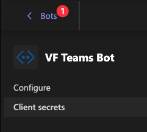

and copy the Bot id

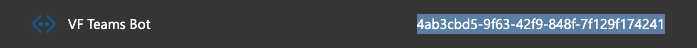

Paste the id in your **.env.template** for the **MicrosoftAppId.**

### 3) Linking the Bot to our Teams App

Go back to the **Apps** tab and click on the **app** you’ve created

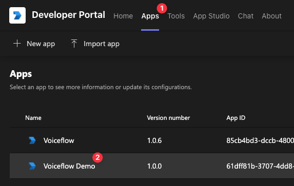

From the **left panel**, click on **App features** and select **Bot** in the **App features list**

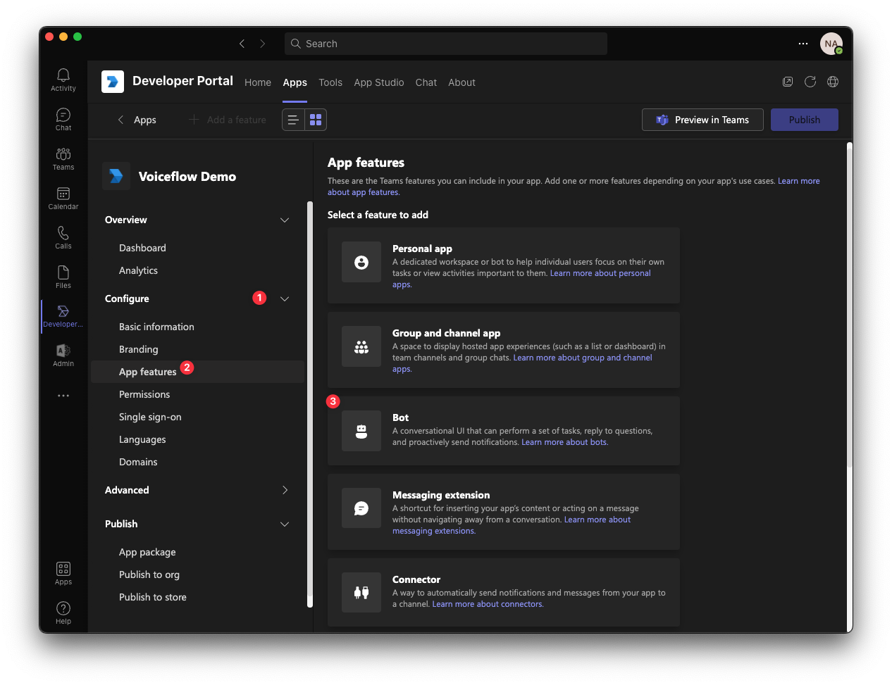

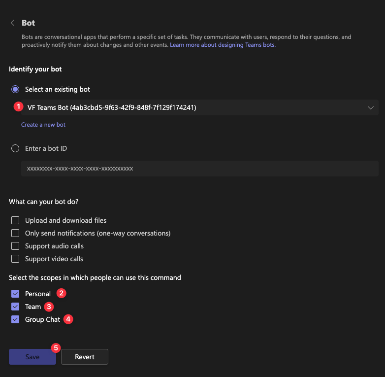

Select your **bot**, check the **last 3 boxes** and click on **Save**

The Teams setup is done, you will be able to Publish your App to your Org store when you will be ready and/or on a production stage.


## 4) Test locally

You are ready to test your bot, rename the .env.template to .env and launch the node app.

```bash
npm test
```

The console should give the following output

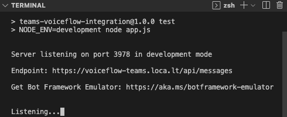

Microsoft share a test tool to help you debugging your Bot, to start testing, download the version for your platform here:

```bash
https://github.com/microsoft/BotFramework-Emulator/releases
```

Install the **Bot Framework Emulator** and open it to create a **Bot configuration**

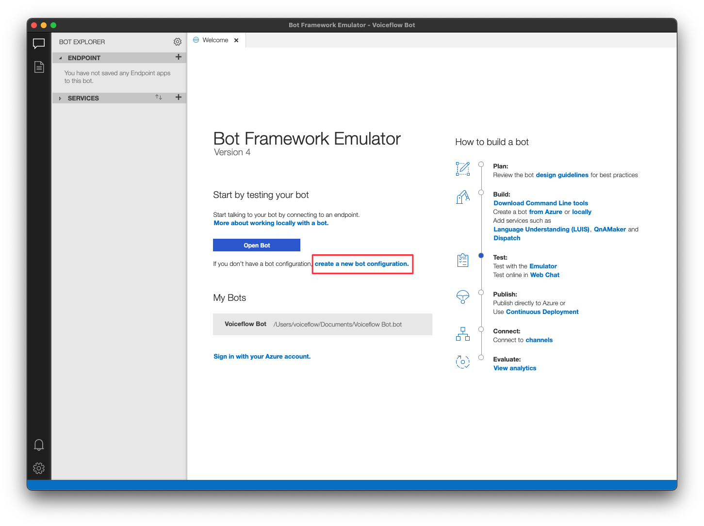

For the endpoint URL, we are testing locally so use (edit the port if you choose another one)

```bash
http://localhost:3978/api/messages
```

Use the Application Id and Password (secret) info from your .env file

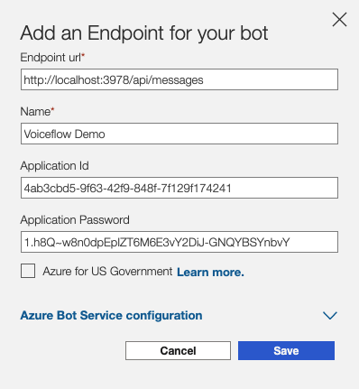

Give the test bot a name and save your configuration.

Congratulations, you are now able to test your bot in the tool and/or Teams!

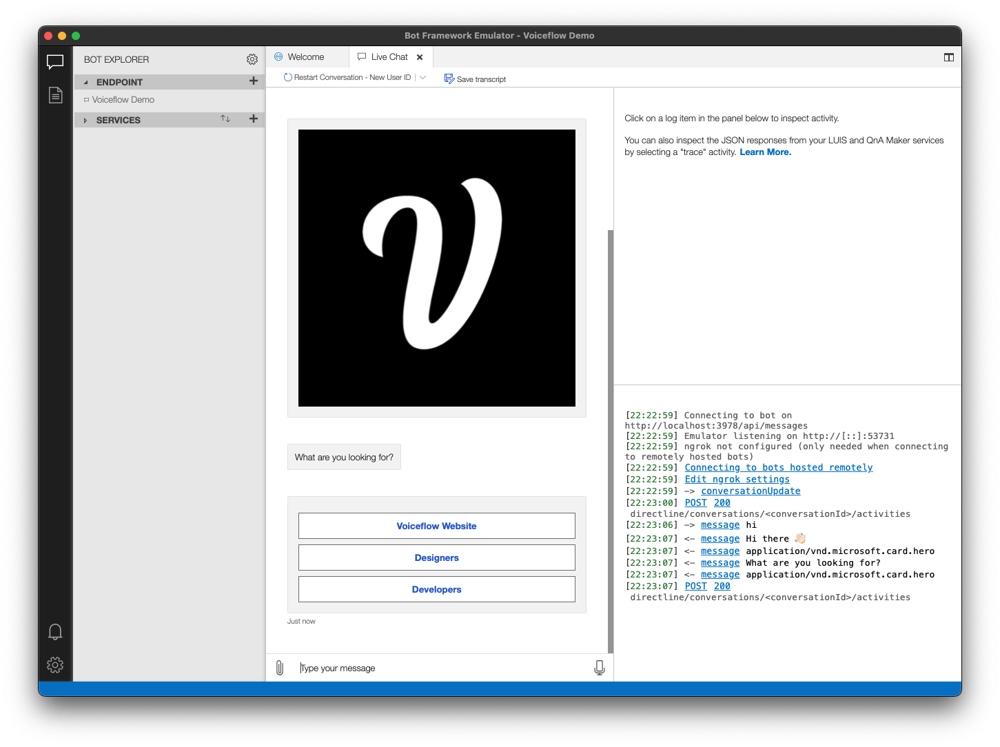

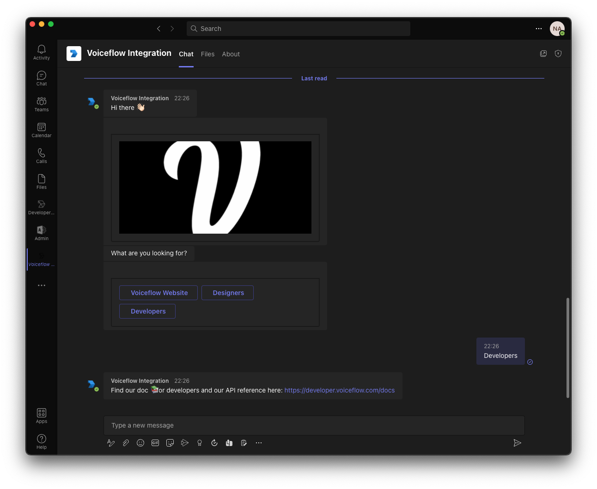
